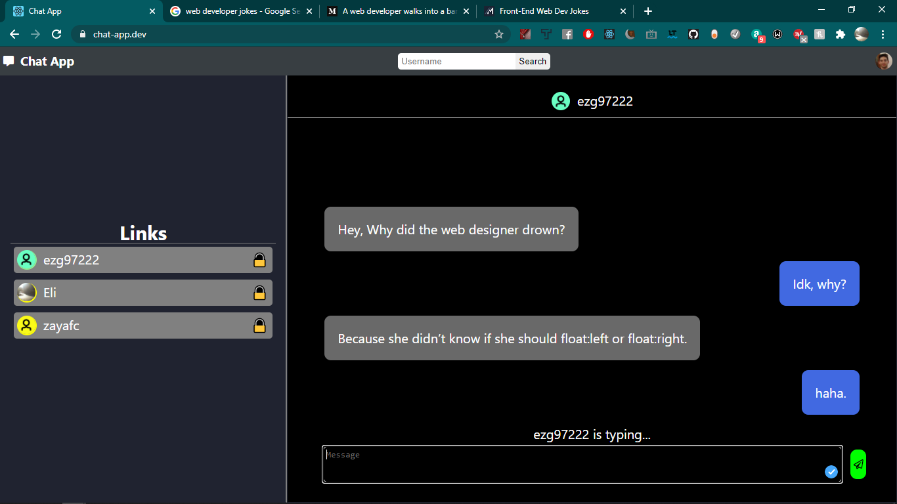

# Chat App Client

Live Site: [Chat App](https://www.chat-app.dev/)

## Description
Signup or login using Oauth 2.0 and chose from a variety of social media platforms: GitHub, Google, Twtch, and LinkedIn. 
Logged into your account, you can search for users and add them to your "Links" (similar to "friends" on FaceBook) and you can chat any user that's online!

## Technologies Used
Created and bootstrapped with create-react-app. This app uses HTML/CSS/React JavaScript and Socket.io to present a complete client side application.
The backend/database uses Node/Exress/PostrgreSQL Socket.io and Passport.js, which you can find here: [Chat App Server](https://github.com/ezg97/chat-app-server)

## Page Layout:

### 1. **This is the landing page, from here you decide which account you'll use to sign in**

### 2. **This is the home page, you can see all of your links on the sidebar, a list of active users (up to 10), a searchbar to find people, and in the right hand corner is your profile picture, click on it and you can select either: Home or Logout**

### 3. **This is the search results page, after searching for someone, anyone relating to your search will be displayed. Click the user's name or thumbnail to open a chat with them**

### 4. **To Link to a user, after searching for them, to the right of their name, click the ":unlock:" emoji, if the emoji shows a ":lock:" then you have been linked!**

 

### 5. **This is the Chat page. This page will be shown when a user is selected and they're online.**

### 6. **This is the page shown when a user is selected, but they are offline**

### 9. **This is how a user logs out or returns to home**

